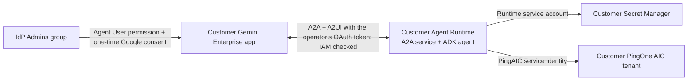

# PingOne AIC Administrator Agent


A Google [ADK](https://google.github.io/adk-docs/) agent that lets Gemini
Enterprise operators run **help-desk / admin operations** against a PingOne
Advanced Identity Cloud (PingAIC) tenant: user lookup, password reset, session
kill, group/role membership changes, direct assignments, and audit lookup, through natural language.

- **Tenant:** the customer’s PingOne AIC tenant, configured with `PING_BASE_URL`.
- **Display name (in Gemini):** *PingOne AIC Administrator Agent*
  (internal id `pingaic_admin_agent`)
- **Runtime:** customer-owned **Agent Runtime** (formerly Vertex AI Agent
  Engine), deploying the ADK agent inside an **A2A** service. Registration uses
  Gemini Enterprise's direct A2A registration with a Google OAuth authorization
  (`cloud-platform` scope): each operator consents once, and Gemini Enterprise
  then calls the runtime with that operator's Google access token. Agent Registry
  and Agent Gateway are not used.
  A2UI v0.9 provides an interactive administration workspace for compatible clients.
- **Operator access:** grant the **Agent User** role on this agent to the
  customer's **IdP Admins** group in Gemini Enterprise, and grant that same
  group Vertex AI User on the runtime project so their tokens can invoke it.
- **PingAIC authentication:** one shared PingOne AIC service account;
  its ID and private JWK are stored in **GCP Secret Manager**, pulled by the
  runtime GCP service account when the agent needs them. Human attribution lives
  in Gemini Enterprise access logs.

## Deployment model

Customers perform two separate steps:

1. **Deploy the agent code** to Agent Runtime in their Google Cloud project with
   `deployment/deploy.py`.
2. **Register the deployed agent** in their existing Gemini Enterprise app as a
   **Custom agent via A2A**, attaching a Google OAuth authorization with the
   `cloud-platform` scope and granting operators runtime invocation IAM.

The A2A registration step connects Gemini Enterprise to the running service; it
does not upload the source code or provision the runtime. **A2A** is the agent
communication protocol. **A2UI** carries the structured UI that a compatible
client renders alongside the agent's text response.



The runtime project and region come from the customer's deployment settings.
The agent is a conversational and A2UI front end to PingOne AIC. AIC owns identity
data and administrative operations. No database is required:
UI controls, confirmations, and A2A protocol tasks stay in a SQLite file on the
instance's local disk, shared by its worker processes, and are discarded when
that instance stops. Agent Runtime's managed Sessions hold chat
history; the front end does not recover open reviews after a restart.
The diagram is the intended access model. The deployer provisions the runtime
and exports its card; the OAuth authorization, registration, invocation IAM,
and Gemini Enterprise user permissions are separate manual configuration. This complete
integration still needs validation in the customer's Google Cloud environment.

### Operator access and authentication

| Connection | Access control |
| --- | --- |
| IdP administrator → Gemini Enterprise agent | Existing Gemini Enterprise sign-in and **Agent User** permission assigned to the **IdP Admins** group. |
| Gemini Enterprise → Agent Runtime | The operator's Google OAuth2 access token with the `cloud-platform` scope on every request. Gemini Enterprise obtains it through the registered authorization after a one-time consent and passes it in the request header; Vertex AI then checks that operator's IAM. The card declares this requirement, and Agent Runtime rejects any other request with 401 before the agent runs. |
| Runtime → PingAIC APIs | Shared PingAIC service identity using its private JWK from Secret Manager; separate API credentials for monitoring. |

No PingAIC user login, consent screen, or delegated administrator token is part
of the agent's application code. Its backend still uses the PingAIC JWT bearer
token grant; removing an interactive OAuth flow does not remove API authentication.
The runtime endpoint itself cannot be made unauthenticated: it is a Vertex AI API
URL, so Google requires the access token whether or not the runtime shares a
project with the Gemini Enterprise app. A shared project only simplifies IAM
setup; it never removes the token.
Google supports agents acting with [their own authority](https://docs.cloud.google.com/iam/docs/auth-agent-own-identity),
and documents [Agent Identity for Gemini Enterprise](https://docs.cloud.google.com/gemini-enterprise-agent-platform/govern/agent-identity-overview).

Gemini Enterprise itself still requires sign-in, which may depend on the IdP
being administered. This circular dependency is accepted for the current rollout;
an independent emergency sign-in path is deferred. The one-time Google consent
is the only additional prompt; the agent adds no PingAIC login.

- [Customer deployment and registration](#customer-deployment-to-agent-runtime)
- [Branding and manual registration bundle](#branding-and-manual-registration-bundle)
- [Runtime behavior and A2UI limits](#runtime-behavior-and-limits)
- [Troubleshooting](#troubleshooting)
- [Agent capabilities](#what-the-agent-can-do)
- [PingAIC credential setup](#auth-flow)
- [Local development and tests](#local-development)

## Customer deployment to Agent Runtime

Deployment and Gemini Enterprise registration are separate, customer-run steps.
This repository creates an A2A service on the customer's managed Agent Runtime;
it does not create their Gemini Enterprise app or register an agent automatically.
Google documents [Agent Runtime as an A2UI hosting option](https://docs.cloud.google.com/gemini/enterprise/docs/a2ui-agents/register-and-manage-an-a2ui-agent).
The [native A2A runtime integration](https://docs.cloud.google.com/gemini-enterprise-agent-platform/build/runtime/create-an-a2a-agent)
is currently Preview.

### 1. Prepare the customer's project

- Use a Google Cloud project with billing enabled and enable the Vertex AI,
  Secret Manager, Cloud Storage, and Discovery Engine APIs.
- Create a staging bucket in the deployment region and a dedicated runtime GCP
  service account. The deployer needs Agent Runtime create/update permissions,
  permission to act as that service account, and write access to the bucket.
- Grant the runtime service account Vertex AI User (`roles/aiplatform.user`) for
  model calls and managed Sessions. Grant Secret Manager Secret Accessor on
  **four individual secrets**: PingAIC service-account ID, private JWK, audit API
  key, and audit API secret. See [PingAIC credential setup](#auth-flow) for the
  secret names and access bindings.
- Have an existing Gemini Enterprise app and an administrator who can add agents.

The deployment identity, runtime service account, and operator group serve
different purposes. Operators need both the Gemini Enterprise **Agent User**
permission and runtime invocation IAM: grant the **IdP Admins** group Vertex AI
User (`roles/aiplatform.user`, or a custom role holding
`aiplatform.reasoningEngines.query`) on the runtime project, because Gemini
Enterprise calls the runtime with each operator's own Google token.
See [Agent Runtime authentication](https://docs.cloud.google.com/gemini-enterprise-agent-platform/scale/runtime/use-an-a2a-agent)
and [registration below](#4-register-in-gemini-enterprise).

### 2. Install and configure

Use Python 3.11, the version used for the offline integration tests. Agent
Runtime runs the agent on the deploying interpreter's Python version, and the
deployer refuses interpreters older than 3.11. Run from this repository's root
in a customer workstation or Cloud Shell environment:

```bash
python3.11 -m venv .venv
source .venv/bin/activate
python -m pip install -r requirements.txt
gcloud auth application-default login
cp deployment.env.example deployment.env
```

The ADC login above authenticates the person deploying and testing the runtime
from their terminal. It does not add an OAuth connection for agent users.

Edit `deployment.env` with the customer's project, region, staging bucket,
runtime service account, tenant URL, realm, and all four Secret Manager version
resource names. This file contains **references**, never secret payloads.
Existing shell variables take precedence over the file. Unset any plaintext
local-development auth variables before deploying; the deployer rejects them.
The same pinned dependency list is used locally and in the managed build.

Use [deployment.env.example](deployment.env.example) as the configuration reference:

| Setting | Customer value |
| --- | --- |
| `GOOGLE_CLOUD_PROJECT` | Project that will own the runtime. |
| `GOOGLE_CLOUD_LOCATION` | Deployment region; the example uses `us-central1`. Set it explicitly to avoid inheriting a gcloud region. |
| `STAGING_BUCKET` | Existing staging bucket URI, such as `gs://your-agent-staging-bucket`. |
| `PING_ADMIN_SERVICE_ACCOUNT` | Dedicated runtime GCP service-account email, distinct from the PingAIC identity. |
| `PING_BASE_URL` | Customer tenant URL without a trailing slash. |
| `PING_REALM` | Target realm; defaults to `alpha`. |
| `PING_SCOPES` | Space-separated PingAIC scopes; defaults to `fr:idm:* fr:am:*`. |
| `PING_ADMIN_MODEL` | Defaults to `gemini-3.5-flash`; must be available to the customer's project and selected model endpoint. |
| `PING_ADMIN_MODEL_LOCATION` | Model inference endpoint; defaults to `global`. Independent of the runtime and Sessions region in `GOOGLE_CLOUD_LOCATION`. |
| `PING_ADMIN_LOGO_URL` | Optional public HTTPS copy of an official Ping Identity logo; defaults to the square mark on Ping Identity's website. Shared by A2A icon metadata and A2UI. |
| `PING_ADMIN_CANVAS_LOGO` | `true` shows the logo in the side-panel header through the basic A2UI `Image` component; `false` (default) shows an icon instead. Gemini Enterprise's `MaterialImage` showed a broken image for external URLs, so the logo stays opt-in until the basic `Image` is confirmed there. |
| `PING_ADMIN_A2UI_ENABLED` | `true` to emit the administration workspace when negotiated; `false` for text responses. |
| `PING_ADMIN_STATE_STORE` | `sqlite` (default and required on Agent Runtime) shares UI controls, approvals and A2A tasks between the instance's worker processes through a file on its local disk; `memory` is for single-process local development only. |
| `PING_ADMIN_STATE_DIR` | Directory for that file inside the instance; defaults to the system temp directory. |
| `PING_ADMIN_A2UI_SURFACE` | `conversation` (default) creates one side-panel surface per conversation and refreshes it in place on every response; `turn` creates a new surface, opener card and panel entry per response. |
| `PING_ADMIN_A2UI_PANEL` | `true` (default) opens composite-catalog workspaces in Gemini Enterprise's side panel with a compact opener card in the chat; `false` renders them inline in the chat stream. The Basic catalog always renders inline. |

All four deployed credential settings must be full Secret Manager **version**
resource names, such as `projects/your-project/secrets/secret-name/versions/latest`:

| Setting | Secret payload |
| --- | --- |
| `PING_ADMIN_SERVICE_ACCOUNT_ID_SECRET` | PingAIC service-account ID. |
| `PING_ADMIN_PRIVATE_JWK_SECRET` | Matching private RSA JWK as JSON. |
| `PING_ADMIN_AUDIT_API_KEY_SECRET` | Monitoring API key. |
| `PING_ADMIN_AUDIT_API_SECRET_SECRET` | Monitoring API secret. |

`PING_ADMIN_AUDIT_USERNAME_FIELD` is optional. Set it only after confirming the
customer's monitoring payload path. `.env` is for local development and is not
automatically loaded by either deployer; `--env-file deployment.env` is explicit.

The default is **Gemini 3.5 Flash** (`gemini-3.5-flash`), a generally available
model with function calling support. Google lists its retirement as **May 19,
2027 or later**. It belongs to Google's models with at least 12 months of
availability after release. See [Google's model lifecycle guide](https://docs.cloud.google.com/gemini-enterprise-agent-platform/models/model-versions).

Model requests use `PING_ADMIN_MODEL_LOCATION=global` by default. Select a
supported endpoint such as `us` or `eu` to meet the customer's processing-location
requirements; see [Gemini 3.5 Flash endpoint availability](https://docs.cloud.google.com/gemini-enterprise-agent-platform/models/gemini/3-5-flash).
The runtime and managed Sessions still use `GOOGLE_CLOUD_LOCATION=us-central1`
in the example. Do not set the runtime region to `global` to select the model
endpoint.

For an existing deployment, update both model settings in `deployment.env` and
run the runtime update command below. Existing environment overrides take
precedence over the new default. Verify tool calls and A2UI using the smoke test;
offline tests do not establish live model quality or project access.

### 3. Deploy and export the registration card

```bash
python -m deployment.deploy --env-file deployment.env --create
```

Review the printed destination and runtime settings, then confirm. The script:

1. Packages `ping_admin_agent.runtime.PingAdminA2aAgent` with the ADK agent/tools.
2. Deploys it to Agent Runtime with the chosen identity and Secret Manager refs.
3. Fetches the **live**, authenticated A2A 0.3 agent card, verifies that it
   declares the Google OAuth2 `cloud-platform` requirement, and writes
   `deployment-output/agent-card.json` and `deployment-output/runtime.json`.
4. Exports `deployment-output/manual-registration.zip` with that card, runtime
   reference, official logo files, Gemini Enterprise icon payload, and manual
   registration instructions. The same files are also available unzipped.

The runtime exposes A2A HTTP+JSON, including the actual 0.3 compatibility routes
`/a2a/v1/message:send` and `/a2a/v1/message:stream`. Its card advertises streaming
and the A2UI v0.9 extension, with URLs pointing to the deployed runtime.
Both native and compatibility cards include the official Ping Identity logo
URL in `iconUrl`. The served card names the project as configured at packaging
time, usually the project ID, while the SDK reports resource names with the
project number; the export accepts either spelling of the same runtime.

The deployer packages from the repository root using
`extra_packages=["ping_admin_agent"]`, then restores the caller's working
directory before exporting registration files. Keep this path relative: SDK
2.1.0 preserves supplied paths inside `dependencies.tar.gz`. An absolute path
would nest the module under the workstation's directory hierarchy, causing
`ModuleNotFoundError` when the runtime loads the agent. This follows Google's
[directory packaging example](https://docs.cloud.google.com/gemini-enterprise-agent-platform/scale/runtime/deploy-an-agent).

After a successful export, load the resource name for the commands below:

```bash
RESOURCE_NAME="$(python -c 'import json; print(json.load(open("deployment-output/runtime.json"))["resource_name"])')"
```

Keep both output files: `agent-card.json` records the live A2A capabilities for
registration and inspection, and `runtime.json` records the resource name and
A2A endpoint used for smoke tests and lifecycle commands. Use `--output-dir PATH`
with create, update, or card export to keep separate environments' output in
separate folders; adjust the path above to match.

If card export fails after deployment, the script prints the created resource
name. Fix ADC/IAM or the runtime error and retry export without creating another
runtime. Set `RESOURCE_NAME` to the full name printed by the failed command,
replacing the placeholders in this example:

```bash
RESOURCE_NAME="projects/YOUR_PROJECT/locations/YOUR_REGION/reasoningEngines/YOUR_AGENT_ID"
python -m deployment.deploy --agent-card "$RESOURCE_NAME"
```

Management commands:

```bash
python -m deployment.deploy --env-file deployment.env --list
python -m deployment.deploy --env-file deployment.env --info "$RESOURCE_NAME"
python -m deployment.deploy --env-file deployment.env --update "$RESOURCE_NAME"
```

Updates export a fresh card. Refresh the registry entry and Gemini Enterprise
registration if capabilities or the endpoint change.

To retire a runtime, delete it with the following command and remove its Gemini
Enterprise registration manually:

```bash
python -m deployment.deploy --env-file deployment.env --delete "$RESOURCE_NAME"
```

### 4. Register in Gemini Enterprise

Use Google's [direct A2A registration](https://docs.cloud.google.com/gemini/enterprise/docs/register-and-manage-an-a2a-agent)
(**Custom agent via A2A**). Google documents that agents hosted on Agent Runtime
need an authorization with the `cloud-platform` scope on this path: Gemini
Enterprise obtains a Google token from each operator once and passes it in the
request header, and Vertex AI checks that operator's IAM. Traffic on this path
does not go through Agent Gateway, so no Agent Registry or gateway setup is
needed.

1. Create a Google OAuth client in the Gemini Enterprise project: a consent
   screen of user type *Internal* with the
   `https://www.googleapis.com/auth/cloud-platform` scope, and a *Web
   application* client whose authorized redirect URI is exactly
   `https://vertexaisearch.cloud.google.com/oauth-redirect`. Keep the client
   secret out of logs and files.
2. Create the authorization resource with the Discovery Engine API. Its
   `authorizationUri` must contain the client ID, that redirect URI,
   `scope=https://www.googleapis.com/auth/cloud-platform`,
   `include_granted_scopes=true`, `response_type=code`, `access_type=offline`,
   and `prompt=consent`; the token URI is `https://oauth2.googleapis.com/token`.
   The exact requests are in the bundle's `REGISTRATION.md`.
3. Register the agent with `a2aAgentDefinition.jsonAgentCard` set to the
   exported live card and `authorizationConfig.agentAuthorization` set to the
   authorization name. Use `agentAuthorization`, not `toolAuthorizations`: only
   the former puts the token in the request header. The console equivalent is
   **Agents → Add agent → Custom agent via A2A**, pasting the card and selecting
   the authorization instead of **Skip & Finish**.
4. Grant the **IdP Admins** group Vertex AI User on the runtime project (see
   step 1 above). Without it, operators receive 403 after consenting.
5. Open the agent's **User permissions → Add user**. Assign **Agent User** to
   the **IdP Admins** group, and remove any broader agent grants. This permission
   authorizes use of every capability exposed by this shared privileged agent.
6. Set the registration's Ping Identity icon by applying the bundle's
   `gemini-enterprise-icon.json` payload. Follow
   [the branding instructions](#branding-and-manual-registration-bundle).

The deployer does not create the OAuth client, the authorization, the
registration, or these permissions. The first time an operator opens the agent,
Gemini Enterprise shows one Google consent prompt; afterwards it refreshes the
token silently. Do not register the runtime as an ADK agent (it exposes only
A2A routes and returns 400), and do not register it via A2A with the
authorization omitted (Gemini Enterprise then has no token and the runtime
returns 401). The Agent Registry import path with Agent Gateway is an
alternative for organizations that want machine identity and gateway policies;
it is not required and is not documented here.

### 5. Verify the deployed integration

Use a search term with at least one matching test user:

```bash
python -m scripts.smoke_runtime "$RESOURCE_NAME" --search-term smith
```

This uses ADC and the real A2A 0.3 streaming client, requests Gemini's composite
catalog, and validates the completed workspace against the published schemas.
Use `--catalog basic` to verify the fallback. It reports status without printing
user records. In Gemini Enterprise, open a matching account, inspect groups and
activity, and verify form validation. Reject a proposed change and verify that
the tenant is unchanged. With a separately authorized test account, approve one
change, check its result, and verify that replaying the approval cannot repeat it.
Check the logo beside the agent's Gemini Enterprise registration and above the
A2UI workspace.
Verify that an IdP Admins member can invoke the agent after the one-time Google
consent, a user outside the group cannot invoke it, and an unauthenticated
request to the runtime is rejected. The terminal smoke test uses the deployer's
ADC; it does not prove that operators hold runtime IAM.

Offline tests cover the SDK's real HTTP routes, card serialization, streaming,
follow-up turns, UI negotiation, and the published A2UI schemas. They use fake
model/tool responses. **A live Google Cloud deployment and Gemini Enterprise
visual rendering have not been verified from this checkout.**

### Branding and manual registration bundle

The official [square Ping Identity mark](https://www.pingidentity.com/content/dam/ping-6-2-assets/topnav-json-configs/Ping-Logo.svg)
is the default for A2A `iconUrl` metadata and for the opt-in A2UI `Image` in the
side-panel header (`PING_ADMIN_CANVAS_LOGO`). White text on a solid red square
reads in light and dark themes. It is loaded from Ping Identity's website and is
not bundled.

The official [horizontal logo](https://www.pingidentity.com/content/dam/picr/nav/Logo-Ping-Brand-Horizontal-Color.svg)
is bundled as local [SVG, PNG, and provenance](ping_admin_agent/assets/README.md)
in every manual registration bundle. The PNG preserves the original artwork and
proportions on white for image uploads. The registration `icon` itself is the
bundled [square mark](logos/PIC-Square-Logo-Primary-2026.png)
(`assets/ping-logo-square-1251.png`), described below.

Gemini Enterprise's registration has its own `icon` field. Set it explicitly
after importing the agent; without it the registration shows the default
initial-letter avatar. Apply `gemini-enterprise-icon.json` with
`updateMask=icon`; the payload sets `icon.uri` to the card's public `iconUrl`,
the same official square mark the PingID Device Management agent shows as its
small circular avatar. Verified live 2026-09-25: Gemini Enterprise renders the
avatar from `icon.uri`; an icon uploaded as inline base64 `content` is stored
but the UI still shows the initial letter. It changes no authentication or
access settings. The exact command is in the bundle's `REGISTRATION.md` and
[the source instructions](deployment/registration-instructions.md).

The bundle contains:

```text
agent-card.json                  Live A2A 0.3 card with iconUrl
runtime.json                     Deployed resource and A2A endpoint
gemini-enterprise-icon.json       Gemini Enterprise icon update body (icon.uri)
branding.json                    Logo source, URL, and asset checksums
assets/ping-logo-square-1251.png  Official square mark for console upload
assets/ping-identity-logo.svg     Unmodified official vector logo
assets/ping-identity-logo.png     PNG rendering for uploads
assets/README.md                 Asset provenance
REGISTRATION.md                  Import, branding, permissions, verification
```

A2A/A2UI clients load the logo from a public HTTPS URL; they do not authenticate
to the runtime to fetch it. If customer policy requires a hosted copy, serve
an official logo (a copy of the square mark, or the bundled horizontal SVG) at a
permitted public HTTPS URL and set
`PING_ADMIN_LOGO_URL`, then update the runtime and export a fresh bundle. No
anonymous agent endpoint is introduced for branding.

### A2UI workspace

The A2A runtime renders structured results from the existing AIC tools. It uses
the Material components in [Gemini Enterprise's composite catalog](https://docs.cloud.google.com/gemini/enterprise/docs/a2ui-agents/a2ui-component-gallery-reference),
with a Basic catalog fallback:

| View | Available interactions |
| --- | --- |
| Workspace | A compact header with the current account and status, then the user search, sized to the screen it is on: a titled "Find a user" card with the only filled button on the start screen, still open among search results where the rows' Open buttons lead, and folded into a single "Find another user" line once an account or anything under it is open. Below it come the newest result in full, earlier results collapsed one click away, and an Applications section at the bottom. |
| User search and profile | Scannable result rows with a status indicator and a single Open action; the opened account shows its first and last name and identifying fields, tonal investigation buttons (groups, roles, assignments, sessions, activity) and outlined change buttons, with password reset and session logout marked as risky. |
| Relationships and applications | Groups, authorization roles and assignments list each record by its display name, with its ID on hover and its reference beneath; refresh controls; application lookup in a labeled table. |
| Activity | A live tail of the chosen audit source for this user. Each event is one line, newest first, with its time, name, result and journey or request; clicking it opens the event's JSON. Refresh adds the events that arrived since, so the list grows while the user retries. |
| Account changes | Forms with human labels, helper text and the target account; Review change first, Back as a text button. Groups and roles each have their own panel, Change groups and Change roles. A panel lists what the user holds, each row with an X that opens the usual review to remove it, and a picker of everything not yet held to add from, by name. Only an offered record is accepted, nothing is preselected, and a long list gets a name filter. The review and the receipt name the record beside its ID. If the tenant cannot list them, the panel falls back to a typed ID. |
| Application forms | OIDC and observed-shape SAML configuration, retained input and validation feedback, followed by review. |
| Change review | Exact target and arguments as a field list, a warning for changes that affect sign-in, Approve as the primary action and Reject as the warn-colored alternative. |
| Outcomes | One success, error or rejection banner with the same sentence as the chat receipt, plus an Open account button to continue. While a request runs, a small spinner appears at the end of the panel header and the context line reads "Working on your request", so no other content moves. |

With the composite catalog, every workspace surface is rooted in Gemini
Enterprise's `Canvas` component: the chat stream shows a compact opener card
named for the view, and the workspace itself renders in the persistent,
resizable side panel beside the conversation, where its tables, forms and
Approve/Reject controls stay visible while the operator keeps chatting. The
surface is created once per conversation, on the first response, and every
later response refreshes it in place with `updateDataModel` and
`updateComponents`, so the panel behaves like a dashboard rather than opening a
new tab per click; earlier controls stay valid until they expire. Set
`PING_ADMIN_A2UI_SURFACE=turn` for a new surface per response, or
`PING_ADMIN_A2UI_PANEL=false` to render the same views inline in the chat. The
Basic catalog has no side panel and always renders a new inline surface per
response.

For A2UI clients a change review is a completed task whose panel carries the
Approve and Reject controls. Every control, including an approval, opens a new
task, and approvals are bound to the conversation and a single-use token rather
than to the task that rendered them. Only text clients receive an
input-required task, because Gemini Enterprise answers input-required with its
own generic text prompt in the chat instead of the panel.

The chat text stays readable alongside the panel: a review lists each change as
its label and exact arguments, a completed operation is one receipt line, and a
read control reports a count. Raw tool JSON is never echoed into the chat;
generated passwords are.

Result screens and receipts name the account by its username rather than its
UUID, and a changed group, role or assignment by its display name. The agent
learns these from the user records and lists it has already shown in the
conversation. A change review leads with the names and still lists the exact IDs
it will act on; an ID is shown alone only when no name is known yet.

Email addresses are never sent as linkable text. Gemini Enterprise turns a bare
address into a `mailto:` link and has no property to switch that off, so every
address in the panel and in the chat, including the model's own wording, is sent
as a Markdown code span. Renderers never link inside one, and copying it yields
the clean address. The line written when an account is opened leaves the address
out for panel clients, because the panel already shows it.

Forms and read controls invoke fixed, server-selected tools and arguments.
The model does not generate executable UI or translate button clicks. Every
mutation, including one requested through chat, requires ADK confirmation and
a current server approval. The model cannot set `confirm=True` to bypass this.
Text clients receive exact `approve TOKEN` / `reject TOKEN` commands for the
pending task; ambiguous prose does not approve a change.

Clients advertise `message.metadata.a2uiClientCapabilities` as
`{"v0.9":{"supportedCatalogIds":[CATALOG_URL]}}`. Supported catalog URLs are:

- `https://www.gstatic.com/vertexaisearch/a2ui/v0_9/gemini_enterprise_composite_catalog.json`
- `https://a2ui.org/specification/v0_9/catalogs/basic/catalog.json`

Header-only negotiation of `https://a2ui.org/a2a-extension/a2ui/v0.9` through
`X-A2A-Extensions` or message extensions selects Basic. Unsupported capabilities
and clients without A2UI receive text. Each completed response carries a full
`createSurface`, `updateDataModel`, `updateComponents` snapshot in structured
`application/json+a2ui` parts, plus relevant `deleteSurface` messages. Streaming
also shows and retires a loading surface. UI payloads stay out of model input.
Set `PING_ADMIN_A2UI_ENABLED=false` and update the runtime to disable rendering;
the confirmation gate remains active.

To inspect synthetic examples generated by the actual view builders:

```bash
python -m scripts.preview_a2ui --output-dir /tmp/pingaic-a2ui-preview
open /tmp/pingaic-a2ui-preview/index.html
```

The local gallery approximates the component layout and emits sample action
events. It makes no tenant or model calls. Gemini Enterprise owns the production
renderer, so validate appearance and action delivery there after deployment.

### Runtime behavior and limits

- UI controls, confirmation choices, session references, and the SDK's A2A
  task bookkeeping are shared by every worker process of the instance through
  a SQLite file on the instance's local disk. Agent Runtime serves an instance
  from several workers and routes each request to any of them, so a click can
  land on a different worker than the search that produced it; the shared file
  is what keeps that click valid. There is no database setup, durable approval
  queue, or background retry. The deployer limits the service to one instance;
  Agent Runtime can scale to zero (`min_instances=0`, `max_instances=1`). A
  restart, redeployment, or scale-to-zero discards the file and its open views
  and tasks. Open a fresh workspace and request the change again before
  approving it.
- Agent Runtime uses managed ADK Sessions for chat history and original tool
  calls. The front end's session reference is temporary, so a fresh request
  after a process restart starts a new session even if the managed service still
  retains earlier history.
- Controls are bound to the conversation, caller identity when provided by the
  transport, source component, and random token. Targets cannot be replaced by
  client fields. Google IAM and Gemini agent permissions remain the access
  boundary; UI tokens do not establish an operator's identity.
- Controls expire after 30 minutes and confirmations after 10 minutes, or sooner
  if the process stops. Each confirmation is consumed before execution within
  that instance. A per-conversation lease, shared by the workers, prevents
  concurrent requests in the same conversation. SDK task snapshots are kept for
  a day or until the instance stops; managed Sessions have their own retention.
- A crash during an approved API call can leave its outcome uncertain. The same
  approval is never retried automatically; check AIC before requesting a fresh
  change. Loss of original session history prevents approval execution.
- User/profile fields and write receipts are projected into explicit columns;
  passwords and application secrets are excluded from UI surfaces. Generated
  passwords are returned in the privileged chat response. In-memory task
  snapshots and managed ADK history therefore contain privileged chat data.

### Troubleshooting

| Symptom | What to check |
| --- | --- |
| Deployment rejects plaintext auth values | Unset the four local plaintext credential variables in the deploying shell. Supply the four `*_SECRET` version references in `deployment.env`. |
| Deployment succeeds but card export fails | Keep the printed resource name. Check ADC, runtime invocation IAM and runtime logs, then retry `--agent-card "$RESOURCE_NAME"`. The failed export does not delete the runtime. |
| Runtime reports `No module named 'ping_admin_agent'` | Inspect the staged `dependencies.tar.gz`: it must contain `ping_admin_agent/__init__.py` at its root, without a workstation path prefix. Redeploy using the corrected create/update commands; clearing `__pycache__` does not correct archive paths. |
| The runtime returns 401 | No Google OAuth2 access token reached Google's front door. From a terminal: run `gcloud auth application-default login`, and use an access token rather than an identity token. From Gemini Enterprise: the registration has no `agentAuthorization`, the operator has not completed the consent, or the authorization URI lacks the `cloud-platform` scope, `access_type=offline` or `prompt=consent`; fix the authorization and re-attach it. Adding IAM grants never fixes a 401. |
| The runtime returns 403 | The token is valid but its identity lacks `aiplatform.reasoningEngines.query` on the runtime project; grant Vertex AI User to that identity. |
| Gemini Enterprise reports an authorization error | Check the IdP Admins agent grant, that the registration references the authorization, and the operator's runtime IAM. PingAIC secret values do not authorize this connection. |
| Gemini Enterprise asks an operator to connect a Google account | Expected once per operator: it is the consent for the `cloud-platform` authorization. If it repeats on every request, the authorization URI lacks `access_type=offline` or `prompt=consent`; recreate the authorization. |
| The logo is missing | Confirm `iconUrl` exists in the live card, apply the Gemini Enterprise icon payload after import, and check that the client can load the HTTPS logo URL. A bundle export reporting missing branding needs a runtime update first. |
| Search works in text but the UI does not appear | Confirm catalog negotiation and the UI setting, refresh the registry entry and registration, and run `scripts.smoke_runtime`. If it passes, check rendering in Gemini Enterprise. |
| Buttons fail with "view expired" on some clicks but not others | The workers are not sharing state. Confirm the runtime environment has `PING_ADMIN_STATE_STORE=sqlite` (the deployer sets it) and that `PING_ADMIN_STATE_DIR`, if set, is a writable directory inside the instance. |
| A control expired or a task is unavailable | Confirmations expire after 10 minutes; a restart, redeployment, or scale-to-zero also discards open views and tasks. Open a fresh workspace and request the change again. Check any uncertain prior write in AIC first. |
| A changed setting or rotated secret is not being used | Update/restart the runtime. Configuration and resolved credentials are cached in the process. |

---

## What the agent can do

| Ask | Tool | PingAIC endpoint |
| --- | --- | --- |
| Find a user by name/email/username | `search_users` | `GET /openidm/managed/alpha_user?_queryFilter=...` |
| View a user | `get_user` | `GET /openidm/managed/alpha_user/{id}` |
| Reset password | `reset_user_password` | `PATCH .../{id}` (`/password`) |
| Enable/disable user | `set_user_status` | `PATCH .../{id}` (`/accountStatus`) |
| Kill sessions | `logout_user_sessions` | `POST /am/.../sessions/?_action=logoutByUser` with exact IDM user UUID |
| List active sessions | `list_user_sessions` | `GET /am/.../sessions?_queryFilter=username eq "<UUID>" and realm eq "/<realm>"`; read-only, and session handles are never returned |
| Unenroll MFA | `unenroll_mfa_device` | `DELETE /am/.../users/{id}/devices/2fa/...` |
| List groups/roles | `list_user_groups` | `GET .../{id}/groups` |
| List group members | `list_group_members` | `GET .../alpha_group/{id}/members` |
| Add/remove group/role | `change_user_membership` | `PATCH .../{id}` |
| List assignments | `list_user_assignments` | `GET .../{id}/assignments` |
| Grant/revoke assignment | `change_user_assignment` | `PATCH .../{id}` |
| Find application | `find_application` | `GET .../alpha_application?_queryFilter=...` |
| Create OIDC client | `create_oidc_application` | `PUT /am/json/realms/root/realms/{realm}/realm-config/agents/OAuth2Client/{clientId}` |
| Create SAML application record | `create_saml_application` | `POST /openidm/managed/alpha_application` (`Accept-API-Version: resource=1.0`) |
| Recent activity | `get_user_activity` | `GET /monitoring/logs` to look back 24 hours (the model's default); `GET /monitoring/logs/tail` with `live=True`, which the panel uses and continues with the returned `pagedResultsCookie` |

Every write requires an explicit `confirm=true`. User lookup uses case-insensitive
substring matching across common identity fields and additionally understands
`First Last` or explicit `Last, First` two-part name searches. Multiple matches
remain ambiguous and must be shown to the operator for selection. The instruction
tells the agent to restate the target and action before it sets the flag. OIDC creation
requires a client ID, application type, redirect URIs for browser clients
(or a private-use custom scheme for native clients), scopes including `openid`,
grant/response types, and token endpoint auth method. Native and SPA clients use
public-client settings and `token_endpoint_auth_method=none`.
It uses the documented native AM OAuth2 client endpoint; it is not a claim that
an undocumented `alpha_application` object creates a complete Application
Management record. The separate SAML tool creates only the observed managed
application record through the documented Alpha Application v1.0 endpoint. Its
v1 contract requires explicit nonblank values for the observed
`templateName="saml"`, `templateVersion="1.1.0"`, `ssoEntities`, and
`appTypeSpecificConfig` shape; it supplies no defaults or inferred URLs, entity
IDs, metadata, certificates, keys, bindings, or other SAML semantics. It
requires `confirm=true`, redacts secret-shaped response/error fields, and is
validated only with mocked HTTP. Live endpoint acceptance and functional SAML
behavior remain unverified and require a separately authorized non-production
contract test before production use. The tool does not orchestrate hosted IdP
creation, `FR_COT` association, remote-SP metadata import, certificate/private-key
setup, or read-back; those full SAML lifecycle steps are excluded from v1. The
locked observed v1 input shape is:

```text
sso_entities: key, idpLocation, idpPrivateId, domain, spLocation, spPrivateId, idpLoginUrl
app_type_specific_config: appLocation, appLocationNoHttps, cotName, roles, tenant
```

All listed values are explicit nonblank strings; top-level `name`, `description`,
`icon`, and `authoritative` are also explicit (with `authoritative` a boolean).
The observed-only response fields `ownerId` and `appNameCap` are intentionally
not part of the create tool/client contract because their create writability is
unverified; they are not validated and cannot be silently dropped from a
request. This is the target tenant's observed read shape, not proof that every
field is writable or accepted by the generic create contract. For session logout, the tool keeps the login username as input, then resolves one exact IDM
`_id` UUID after confirmation; it POSTs `{"username":"<user UUID>"}` to the
trailing-slash sessions endpoint with `Accept-API-Version: resource=5.1,
protocol=1.0`. Zero, multiple, or missing-ID matches are errors, with no
broad/per-session fallback.

**Out of scope for v1:** creating brand-new users, deletion, journey/tree
management, bulk operations.

---

## Auth flow

### PingAIC side (one-time)

Create a PingOne AIC **service account** and register its **public RSA JWK** in the tenant. Keep the matching private JWK offline; PingAIC never receives the private material. Grant the service account only the scopes and admin groups needed by this agent (typically `fr:idm:* fr:am:*` plus the IDM/AM admin groups).

The client uses the documented service-account JWT bearer grant. It POSTs to `https://<tenant-environment-fqdn>:443/am/oauth2/access_token` with `client_id=service-account`, `grant_type=urn:ietf:params:oauth:grant-type:jwt-bearer`, `assertion=<RS256 JWT>`, and the space-separated `scope`. The assertion uses `iss` and `sub` equal to the PingAIC service-account ID, `aud` equal to the exact token URL including `:443`, `exp=now+899`, and a unique `jti`. This is **not** `private_key_jwt`, client credentials, or `client_secret_basic`.

### GCP side (one-time)

Store all four credential values in Secret Manager and grant the **runtime GCP service account** read access to those secrets. The PingAIC service-account ID is an identity inside PingAIC; it is not the GCP runtime service account selected by `PING_ADMIN_SERVICE_ACCOUNT`.

```bash
PROJECT_ID="your-gcp-project"
RUNTIME_SA=ping-aic-admin-agent@$PROJECT_ID.iam.gserviceaccount.com
printf %s "$PING_ADMIN_SERVICE_ACCOUNT_ID" | gcloud secrets create pingaic-admin-service-account-id --project="$PROJECT_ID" --data-file=-
printf %s "$PING_ADMIN_PRIVATE_JWK" | gcloud secrets create pingaic-admin-private-jwk --project="$PROJECT_ID" --data-file=-
printf %s "$PING_ADMIN_AUDIT_API_KEY" | gcloud secrets create pingaic-admin-audit-key --project="$PROJECT_ID" --data-file=-
printf %s "$PING_ADMIN_AUDIT_API_SECRET" | gcloud secrets create pingaic-admin-audit-secret --project="$PROJECT_ID" --data-file=-

for secret in pingaic-admin-service-account-id pingaic-admin-private-jwk pingaic-admin-audit-key pingaic-admin-audit-secret; do
  gcloud secrets add-iam-policy-binding "$secret" --project="$PROJECT_ID" \
    --member="serviceAccount:$RUNTIME_SA" --role="roles/secretmanager.secretAccessor"
done
```

### At runtime

For local development, set both `PING_ADMIN_SERVICE_ACCOUNT_ID` and `PING_ADMIN_PRIVATE_JWK` in an untracked `.env`. For Agent Runtime, set only the paired refs `PING_ADMIN_SERVICE_ACCOUNT_ID_SECRET` and `PING_ADMIN_PRIVATE_JWK_SECRET`; `config.py` fetches both with ADC when configuration is first needed. Partial or mixed plaintext/reference configuration is rejected. Private JWK and generated assertions are never logged, and the frozen config's repr and equality do not expose key material.

The monitoring audit API is a separate credentialed surface. Set
`PING_ADMIN_AUDIT_API_KEY_SECRET` and `PING_ADMIN_AUDIT_API_SECRET_SECRET` to
Secret Manager resource names in deployed runtimes (or the matching plaintext
variables only for local testing). The client sends these values as
`x-api-key` and `x-api-secret` only to `GET /monitoring/logs`; IDM, AM, and the
token endpoint never receive them. Audit 401 errors identify these credentials,
not service-account scopes. Username filtering is disabled unless the tenant's
documented audit payload path is explicitly set in
`PING_ADMIN_AUDIT_USERNAME_FIELD`; the client does not guess a field name.

---

## Local development

```bash
python3.11 -m venv .venv
source .venv/bin/activate
python -m pip install -r requirements.txt
cp .env.example .env       # fill tenant, local credentials and model project
gcloud auth application-default login
adk web .                  # local text chat with ADK's tool confirmation prompts
```

The ADK developer UI exercises the tools and confirmation gates with the local
`.env` credentials as a text chat; it does not render A2UI. The A2A runtime and
the administration workspace are covered by the offline suite below and checked
live with `scripts.smoke_runtime` after deployment.

### Unit tests (offline, network mocked)

```bash
python -m pip install -r requirements-dev.txt
python -m pytest -q
```

The SAML tests use mocked HTTP only; they do not create or mutate tenant
applications. No live acceptance claim is made by the offline suite.

### Real tenant smoke

The following script reads the shell environment; export the local credentials
or Secret Manager references first. It does not automatically load `.env`.
Set `USER_ID` to a search result's `_id` and `USER_NAME` to its login before
running the individual lookup examples.

```bash
python -m scripts.try_api search-users --q smith
python -m scripts.try_api get-user "$USER_ID"
python -m scripts.try_api groups "$USER_ID"
python -m scripts.try_api assignments "$USER_ID"
python -m scripts.try_api activity "$USER_NAME" --source am-authentication
```

The `try_api` script is read-only. Exercise the destructive tools through the
running agent against a test user in a non-production realm.

---

## Layout

```
ping_admin_agent/
  __init__.py
  agent.py            ADK agent, 15 tools and confirmation gates
  a2a.py              A2A cards, extension negotiation and ADK executor
  a2ui.py             A2UI v0.9 wire constants
  branding.py         shared official logo URL and asset locations
  assets/             official SVG, upload PNG, and provenance
  runtime.py          serializable managed A2A runtime and compatibility card
  ui_runtime.py       structured tool results, UI dispatch and ADK confirmation
  ui_store.py         worker-shared SQLite state, conversation lease and A2A task store
  ui_protocol.py      composite/Basic negotiation and schema validation
  ui_components.py    deterministic component builders and data bindings
  ui_views.py         AIC result views, forms, loading and confirmation surfaces
  ui_actions.py       server-bound action tokens and field validation
  ui_results.py       structured observations and text fallbacks
  confirmed_tool.py   ADK gate with single-use grants for exact tool arguments
  schemas/            vendored A2UI and Gemini composite catalog schemas
  auth.py             RSA private-JWK validation + RS256 JWT assertions
  config.py           env + Secret Manager loader; frozen PingAdminConfig
  ping_client.py      HTTP client: JWT token cache + IDM/AM/monitoring methods
deployment/
  __init__.py         refuses Python interpreters older than 3.11
  registration.py     portable manual registration bundle and icon payload
  registration-instructions.md  instructions shipped inside the bundle
  deploy.py           Agent Runtime A2A create/update/list/info/delete and card
                      export; forwards Secret Manager references only
scripts/
  try_api.py          drive PingClient against a real tenant (read-only)
  smoke_runtime.py    check deployed A2A streaming and structured A2UI output
  preview_a2ui.py     synthetic gallery from the production view builders
tests/
  test_auth.py             JWK validation + signed JWT claims/header
  test_deployment.py       customer deployment configuration and live-card export
  test_deployment_packaging.py  real SDK archive extraction and isolated runtime loading
  test_runtime_a2a.py      real SDK routes, serialization, streaming and follow-ups
  test_admin_ui.py         views against both catalogs, forms, approvals, replay,
                           tampering and restart over the real 0.3 REST routes
  test_ui_store.py         shared SQLite state, single-use consumption across workers, leases
  test_model.py            model and endpoint selection through the Gen AI serializer
  test_config.py           Secret Manager loader + env/ref validation
  test_ping_client.py      JWT grant, token cache, 401 handling, URL construction
  test_agent_tools.py      confirm gating + input validation + error mapping
  conftest.py              fixtures: config cache, stub_config, managed runtime env
```

## Verify before trusting in production

- [ ] `python -m pytest -q` passes.
- [ ] SAML managed-application create has passed a separately authorized
      non-production live contract test; until then, endpoint acceptance and
      functional SAML behavior remain unverified.
- [ ] PingAIC has the public JWK for this service account and grants the
      required scopes/admin groups to that service account.
- [ ] The Agent Runtime service account has
      `roles/secretmanager.secretAccessor` only on the four configured
      credential secrets. Agent Runtime build/deployer permissions do not grant
      runtime secret access; verify both identities separately.
- [ ] Rotate JWKs by registering the new public key, deploying the matching
      private JWK secret version, verifying a token, then retiring the old key.
- [ ] Gemini Enterprise grants **Agent User** only to the **IdP Admins** group.
      A group member can use the agent after a one-time Google consent, and a
      user outside the group is denied.
- [ ] The IdP Admins group holds runtime invocation IAM and the registration
      references the `cloud-platform` authorization; unauthenticated runtime
      requests are denied.
- [ ] The runtime smoke test passes and two searches render in the same
      Gemini Enterprise conversation.
- [ ] The official logo appears in the registered agent's icon and A2UI header;
      the exported registration bundle includes the logo assets and icon payload.
- [ ] `try_api search-users --q <known-user>` returns the expected user.
- [ ] A `set_user_status` against a test user flips its `accountStatus` in the
      tenant, and flipping back returns to `active`.
- [ ] Confirm gating: ask the agent to reset a password *without* explicitly
      confirming; verify it refuses and does not call the API.

## Next steps

- **User creation / deletion**: same pattern, additional tools.
- **Journeys and auth trees**: read/list only, for troubleshooting.
- **Slack / ticketing bridge**: pull recent tickets for a user before acting.
